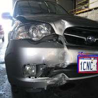
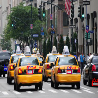
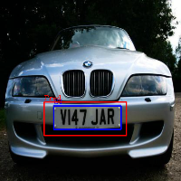

# Implementation of YOLOv3 with Seq-NMS for License Plate Detection

## Dependencies

The code has been tested on Ubuntu 18.04 with Python 3.7, PyTorch 1.10.0, and CUDA 11.3. All required packages are
listed in `environment.yml`. You can use [Anaconda](https://www.anaconda.com/products/individual) to set up a Python
environment by running

```
conda env create -f environment.yml
```

After the installation finishes, activate the environment by

```
conda activate yolov3
```

## Datasets

Two datasets are used in this repository to train and evaluate the model. They can be found from
[here](https://www.kaggle.com/datasets/andrewmvd/car-plate-detection) and
[here](https://public.roboflow.com/object-detection/license-plates-us-eu). Note that when downloading data from
roboflow, download the Pascal VOC format. After downloading the datasets, reorganize the data according to the following
file structure

```
YOLO3_plate_recognition/
|-- environment.yml
|-- eval_plate.py
|-- loss.py
|-- model.py
|-- plate_dataset.py
|-- process_dataset.py
|-- README.md
|-- train_plate.py
|-- utils.py
|-- dataset/
|   |-- archive/
|   |-- License Plates.v3-original-license-plates.voc/
```

The datasets are split such that the Kaggle dataset and the training set of the roboflow dataset will be used for
training, while the validation set and test set of the roboflow dataset are reserved for validation and testing,
respectively. Run the following command to split the dataset.

```
python process_dataset.py
```

## Training

To train the [YOLOv3](https://arxiv.org/abs/1804.02767) model, use the command below

```
python train_plate.py --conf_thres 0.4 --AP_iou_thres 0.5 --nms_iou_thres 0.4 \
                      --label_iou_thres 0.5 --num_workers 1 --batch_sz 16 \
                      --scheduler_step 200 --scheduler_rate 0.1 --num_epochs 400 \
                      --log_freq 1000 --save_freq 100 \
                      --lambda_box 10 --lambda_obj 6 --lambda_noobj 10 \
                      --model_name yolov3_plate_10_6_10
```

The above command will train the model for 400 epochs. The checkpoint weights are saved in `log/yolov3_plate_10_6_10` every 100
epochs. E.g., the weights obtained after training the model for 400 epochs can be found in `log/yolov3_plate/400`. In
the same folder, the Tensorboard events which log the training/validation loss and sample outputs is also available. To
view these events, run

```
cd log/yolov3_plate_10_6_10
tensorboard --logdir=$PWD --samples_per_plugin=images=100
```

## Evaluation on Images

After the above training is completed, the model weights are saved in `log/yolov3_plate_10_6_10/400`.
Alternatively, you can download weights of the trained model from [OneDrive](https://1drv.ms/u/s!Ai577MWqjhXlrniNJsP1PDaslfYl?e=ShsvYn).
After downloading and unzipping the checkpoint files, move them according to the following file structure.
```
YOLO3_plate_recognition/
|-- environment.yml
|-- eval_plate.py
|-- loss.py
|-- model.py
|-- plate_dataset.py
|-- process_dataset.py
|-- README.md
|-- train_plate.py
|-- utils.py
|-- log/
|   |-- yolov3_plate_10_6_10/
|   |   |-- 400/
|   |   |   |-- adam.pth
|   |   |   |-- model.pth
|-- dataset/
|   |-- archive/
|   |-- License Plates.v3-original-license-plates.voc/
```

To evaluate the model with these pretrained weights on the test set, run

```
python eval_plate.py --model_name eval_yolov3_plate \
                     --pretrained_model log/yolov3_plate_10_6_10/400 --img_sz 416 \
                     --conf_thres 0.7 --AP_iou_thres 0.5 --nms_iou_thres 0.05 \
                     --label_iou_thres 0.5 --device cuda --split 2 --log_freq 1 
```

If you want to run evaluation on the validation set, change `--split 2` to `--split 1`.

A tensorboard event is saved in `log/eval_yolov3_plate` during evaluation. To visualize these results, run

```
cd log/eval_yolov3_plate
tensorboard --logdir=$PWD --samples_per_plugin=images=100
```

The evaluation on the provided trained weights should yield an average precision (AP) of 0.7525 with the following 
sample output images.




## Evaluation on Videos
We further evaluated our model on video clips. Note that applying the vanilla YOLOv3 to process the video clip frame by 
frame may not yield good results. For example, the model may fail to detect license plates in certain frames. To remedy 
this problem, we further incorporated [Seq-NMS](https://arxiv.org/abs/1602.08465) as a post processing step in our 
pipeline. 

To demonstrate the results, we first need to download videos to the current directory. The code can process videos saved 
in two different forms: `mp4` format or video frames that have been separated and saved as image files. In this demo, we 
use the latter case. We use the `2011_09_26_drive_0057` clip from the [KITTI raw dataset](https://www.cvlibs.net/datasets/kitti/raw_data.php). 
Download this clip and saved the files according to the following structure.

```
YOLO3_plate_recognition/
|-- environment.yml
|-- eval_plate.py
|-- loss.py
|-- model.py
|-- plate_dataset.py
|-- process_dataset.py
|-- README.md
|-- train_plate.py
|-- utils.py
|-- log/
|   |-- yolov3_plate_10_6_10/
|   |   |-- 400/
|   |   |   |-- adam.pth
|   |   |   |-- model.pth
|-- dataset/
|   |-- archive/
|   |-- License Plates.v3-original-license-plates.voc/
|   |-- video_test/
|   |   |-- 2011_09_26_drive_0059_sync/
|   |   |   |-- 2011_09_26/
|   |   |   |   |-- 2011_09_26_drive_0059_sync/
|   |   |   |   |   |-- image_02/
|   |   |   |   |   |   |-- data/
|   |   |   |   |   |   |   |-- 0000000000.png
|   |   |   |   |   |   |   |-- 0000000001.png
|   |   |   |   |   |   |   |-- ...
```

Then we can run the following script to make predictions on all frames in the video clip.
```
python test_video_seq_nms.py --src_data ./dataset/video_test/2011_09_26_drive_0059_sync/2011_09_26/2011_09_26_drive_0059_sync/image_02/data \
                             --model_name detect_video_seq_nms --pretrained_model log/yolov3_plate_10_6_10/400 \
                             --img_sz 416 --conf_thres 0.7 --nms_iou_thres 0.05 \
                             --device cuda --seq_nms \
                             --seq_conf 0.1 --seq_iou 0.5 --seq_nms_rescore max 
```
Note that by removing the `--seq_nms`, we can remove the Seq-NMS post processing step. The results and the comparison 
between vanilla YOLOv3 and YOLOv3 with Seq-NMS can be seen in this [video](https://youtu.be/HJgpg_u922M).

## Acknowledgments

The code is heavily based on
this [repository](https://github.com/aladdinpersson/Machine-Learning-Collection/tree/master/ML/Pytorch/object_detection/YOLOv3). 
We would also like to thank the authors for [YOLOv3](https://arxiv.org/abs/1804.02767) and [Seq-NMS](https://arxiv.org/abs/1602.08465) for their amazing work.
