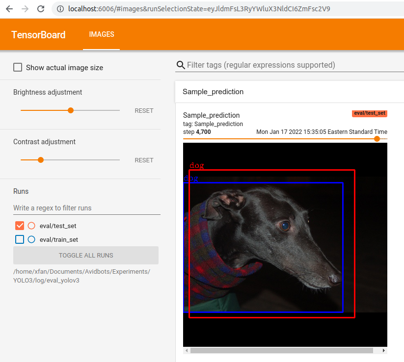

# Implementation of YOLOv3 and Confidence Estimation

This is an implementation of [YOLOv3](https://arxiv.org/pdf/1804.02767.pdf) model for object detection with code to test
our proposed confidence estimation algorithm.

## Dependencies

The code has been tested on Ubuntu 18.04 with Python 3.7, PyTorch 1.10.0, and CUDA 11.3. All required packages are
listed in `environment.yml`. You can use [Anaconda](https://www.anaconda.com/products/individual) to set up a Python
environment by running

```
conda env create -f environment.yml
```

After the installation finishes, activate the environment by

```
conda activate yolov3
```

## Datasets

Three datasets are used in this repository: Pascal VOC 2012, Pascal VOC 2007, and Pascal VOC 2007 test. The VOC 2012
dataset can be downloaded from [here](http://host.robots.ox.ac.uk/pascal/VOC/voc2012/), and both VOC 2007 datasets are
available [here](http://host.robots.ox.ac.uk/pascal/VOC/voc2007/index.html). After downloading these datasets, unzip
them and place them under a folder called `VOC/`. In this instruction, assume `VOC/` is placed under the same project
folder. Therefore, the file structure should be

```
YOLO3/
|-- config.py
|-- dataset.py
|-- environment.yml
|-- eval.py
|-- loss.py
|-- model.py
|-- process_dataset.py
|-- README.md
|-- train.py
|-- utils.py
|-- VOC/
```

The folder structure inside the `VOC/` directory should follow the below. You may need to move/rename some folders after
unzipping the datasets.

```
VOC/
|-- VOC2007/
|   |-- Annotations/
|   |-- ImageSets/
|   |-- JPEGImages/
|   |-- SegmentationClass/
|   |-- SegmentationObject/
|-- VOC2007_test/
|   |-- Annotations/
|   |-- ImageSets/
|   |-- JPEGImages/
|   |-- SegmentationClass/
|   |-- SegmentationObject/
|-- VOC2012/
|   |-- Annotations/
|   |-- ImageSets/
|   |-- JPEGImages/
|   |-- SegmentationClass/
|   |-- SegmentationObject/
```

To properly train the model, VOC 2007 and VOC 2012 will be used as the training data, while VOC 2007 test is reserved
for evaluation. To facilitate easier file access for later, run `process_dataset.py` by

```
python process_dataset.py --dataset_path ./ --dataset_name VOC
```

Running this script will create two text files inside the `VOC/` folder to indicate the training set and evaluation set.

## Training

### Training on the Full Dataset

To train the model with an entire training set on a GPU, use the command below

```
python train.py --data_path ./ --dataset VOC --log_path log \
                --model_name train_yolov3 \
                --img_sz 416 --num_cls 20 \
                --seed 0 \
                --conf_thres 0.2 --mAP_iou_thres 0.5 --nms_iou_thres 0.45 --label_iou_thres 0.5 \
                --device cuda --num_workers 2 \
                --batch_sz 32 \
                --lr 0.0001 --scheduler_step 200 --scheduler_rate 0.1 --weight_decay 0.0005 --num_epochs 400 \
                --lambda_box 10 --lambda_obj 1 --lambda_noobj 10  --lambda_cls 1 \
                --log_freq 1000 --save_freq 100 
```

The above command will train the model for 400 epochs. The checkpoint weights are saved in `log/train_yolov3` every 100
epochs. E.g., the weights obtained after training the model for 400 epochs can be found in `log/train_yolov3/400`. In
the same folder, the Tensorboard events which log the training/validation loss and sample outputs is also available. To
view these events, run

```
cd log/train_yolov3
tensorboard --logdir=$PWD
```

### Training on a Reduced Dataset

In the case when you don't have a GPU and just want to verify the code is running on a reduced dataset, make the
following modifications. Go to line 101-104 of `train.py` and change the lines from

```
self.train_dataset = PascalVOC(data_path, True, self.norm_anchors, self.args.img_sz, self.args.num_cls,
                               self.scales, self.args.label_iou_thres, sanity=False)
self.val_dataset = PascalVOC(data_path, False, self.norm_anchors, self.args.img_sz, self.args.num_cls,
                             self.scales, self.args.label_iou_thres, sanity=False)
```

to

```
self.train_dataset = PascalVOC(data_path, True, self.norm_anchors, self.args.img_sz, self.args.num_cls,
                               self.scales, self.args.label_iou_thres, sanity=True)
self.val_dataset = PascalVOC(data_path, False, self.norm_anchors, self.args.img_sz, self.args.num_cls,
                             self.scales, self.args.label_iou_thres, sanity=True)
```

By setting the sanity flag to `True`, the dataset is reduced to 4 images only. Then run the command below to verify the
training code

```
python train.py --data_path ./ --dataset VOC --log_path log \
                --model_name train_yolov3 \
                --img_sz 416 --num_cls 20 \
                --seed 0 \
                --conf_thres 0.2 --mAP_iou_thres 0.5 --nms_iou_thres 0.45 --label_iou_thres 0.5 \
                --device cpu --num_workers 0 \
                --batch_sz 2 \
                --lr 0.00001 --scheduler_step 200 --scheduler_rate 0.1 --weight_decay 0.0005 --num_epochs 200 \
                --lambda_box 10 --lambda_obj 1 --lambda_noobj 10  --lambda_cls 1 \
                --log_freq 10 --save_freq 100 
```

## Evaluation

After the above training is completed, the model weights are saved in `log/train_yolov3/400`. To evaluate the model with
these pretrained weights on the test set, run

```
python eval.py --data_path ./ --dataset VOC --log_path log \
               --model_name eval_yolov3 --pretrained_model log/train_yolov3/400 \
               --img_sz 416 --num_cls 20 \
               --conf_thres 0.2 --mAP_iou_thres 0.5 --nms_iou_thres 0.45 --label_iou_thres 0.5 \
               --device cuda --log_freq 100 
```

Alternatively, the pretrained weights can also be downloaded which yields the following results

| mAP |  Download Link | 
|---|---|
| 0.46 |  [OneDrive](https://1drv.ms/u/s!Ai577MWqjhXlkArGDghGedGiLrXT?e=Phxg95) |

After downloading the zipped file, uncompress it and place the folder in `log/` and the weights are stored in
`log/yolov3_pretrained`. To run evaluation on these weights, use

```
python eval.py --data_path ./ --dataset VOC --log_path log \
               --model_name eval_yolov3 --pretrained_model log/yolov3_pretrained \
               --img_sz 416 --num_cls 20 \
               --conf_thres 0.2 --mAP_iou_thres 0.5 --nms_iou_thres 0.45 --label_iou_thres 0.5 \
               --device cuda --log_freq 100 
```

The resulting mAP should be close to the one shown in the table.

In both commands above, a tensorboard event with sample outputs is saved in `log/eval_yolov3`. To visualize these
results, run

```
cd log/eval_yolov3
tensorboard --logdir=$PWD
```

Open a browser window and go to `http://localhost:6006/` or the URL given by Tensorboard. You can now see the results.


## Confidence Prediction

First, run the `eval.py` script on the training set with the following settings first to obtain the prior accuracy
information. The command to run this is

```
python eval.py --data_path ./ --dataset VOC --log_path log \
               --model_name eval_yolov3 --pretrained_model log/yolov3_pretrained \
               --img_sz 416 --num_cls 20 \
               --conf_thres 0.8 --mAP_iou_thres 0.5 --nms_iou_thres 0.45 --label_iou_thres 0.5 \
               ----train_split \
               --device cuda --log_freq 100 
```

After the script finishes running, record the number of TP and FP bounding boxes. Verify these numbers are consistent
with line 97 to 100 of `predict.py`. These numbers serve as the prior accuracy information for our proposed confidence
measure.

Before running the confidence prediction code, we need to split the validation set into two splits: one as a validation
split to generate the posterior accuracy, and a test split for testing the confidence score. This preprocessing is done
by running

```
python gen_predict_datasets.py --data_path ./ --dataset VOC --split 0.8 --seed 75
```

After obtaining the prior information and splitting the dataset, we can run the `predict.py` to calculate the confidence
score. The command is

```
python predict.py --data_path ./ --dataset VOC --log_path log \
                  --model_name predict_yolov3 --pretrained_model log/yolov3_pretrained \
                  --img_sz 416 --num_cls 20 \
                  --test_conf_thres 0.8 --eval_conf_thres 0.8 --mAP_iou_thres 0.5 --nms_iou_thres 0.45 --label_iou_thres 0.5 \
                  --device cuda --desired_acc 0.65 --log_freq 10 
```

The computed confidence score for all classes will be printed out. The corresponding tensorboard events are saved
in `log/predict_yolov3`. The final output images with bounding boxes and accuracy indication according to the proposed
confidence score are also saved in the same folder.

## Acknowledgments

The code is heavily based on
this [repository](https://github.com/aladdinpersson/Machine-Learning-Collection/tree/master/ML/Pytorch/object_detection/YOLOv3)
.
